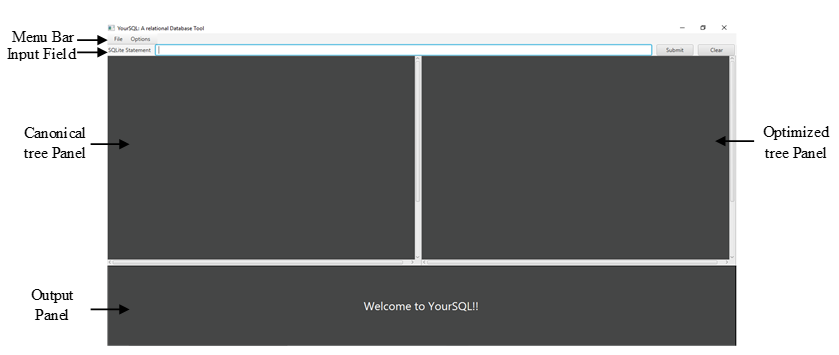
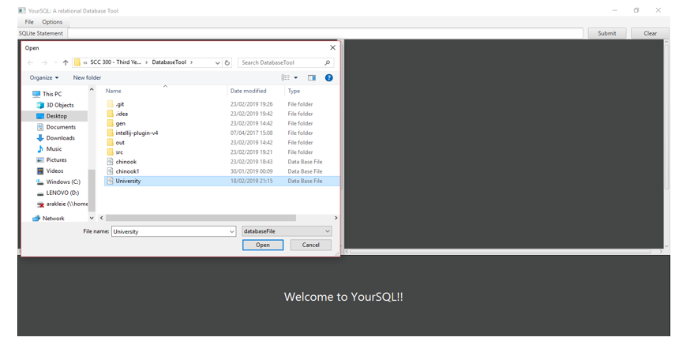
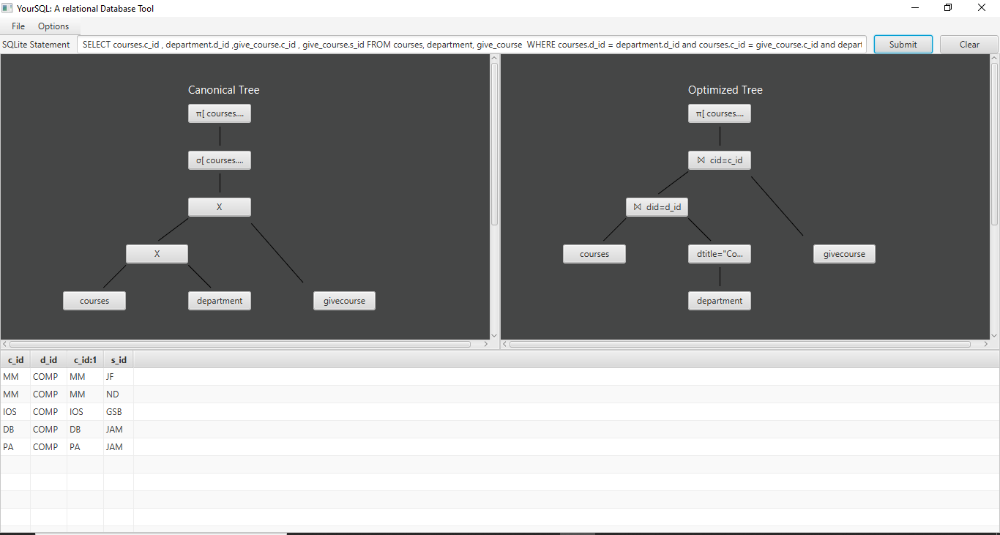
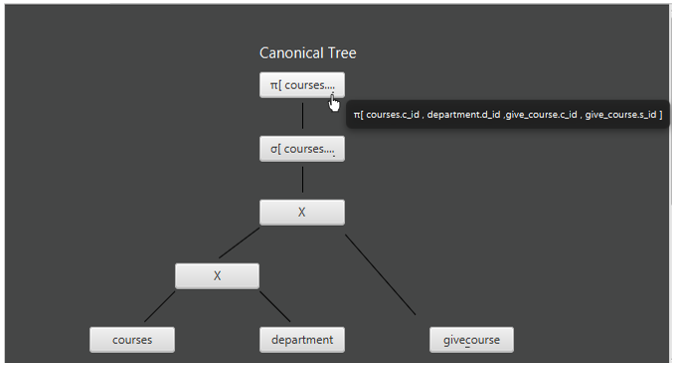
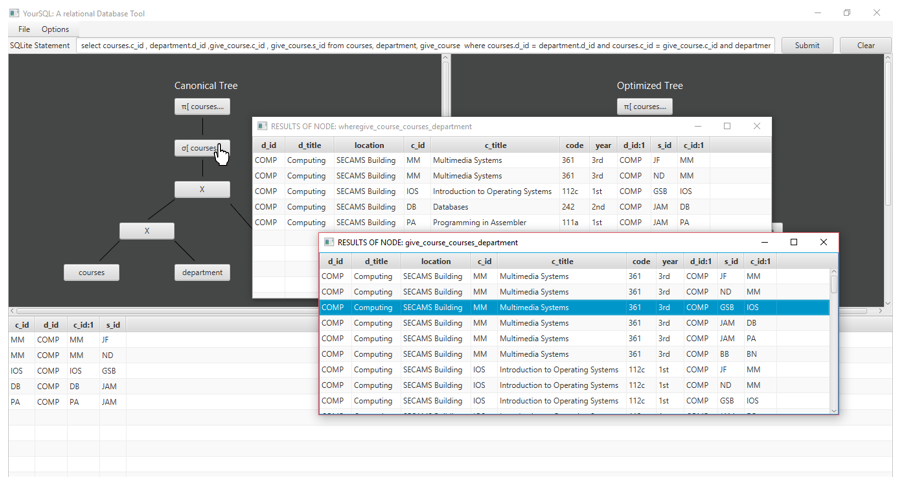
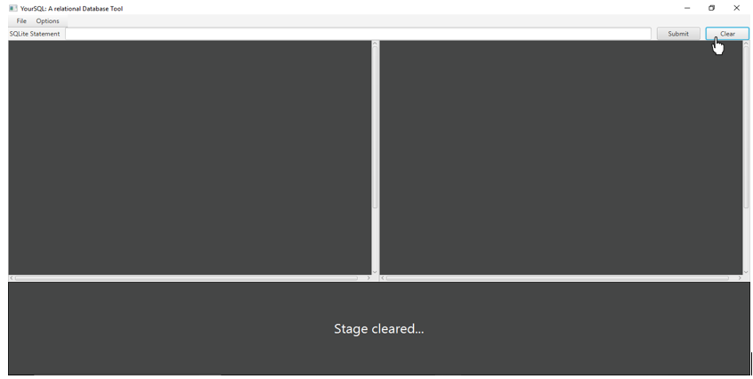
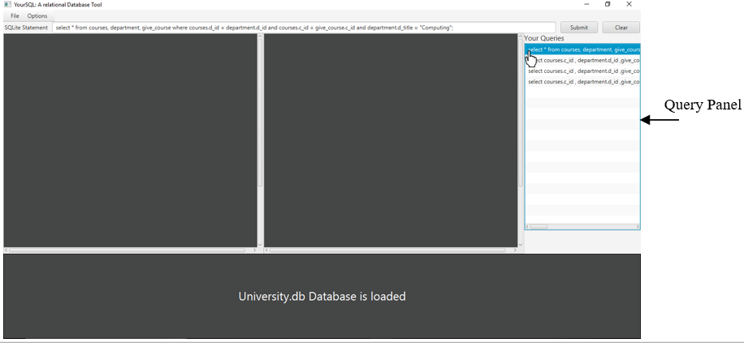

# YourSQL: A Relational Database Tool for pedagogical purposes

YourSQL is a relational database tool used for teaching relational algebra and the SQL language and help the learner understand how these topics are associated. The system intends to provide the users an interactive approach to utilize their knowledge of the theoretical aspects of these topics and a practical approach to familiarize themselves with their operations.

The System make use of the SQLite Database Management system so any databases intended for YourSQL should be SQLite databases.

## Overview
The user submits a SQL statement that is converted into a canonical tree that is built using relational algebra operations and the corresponding optimized tree. Additionally, the intermediate results of every execution step are available to allow comparison between the execution process.

Click <a download="YourSQL.exe" href="YourSQL.exe" title="executable"> here </a> to download the application

Click <a download="University.db" href="University.db" title="database"> here </a> to download a sample database

## Let’s get started!!

You can start YourSQL, by double clicking on the Java executable application named “YourSQL”.

### Application Components
1. Menu Bar: Provides operations
2. Input Field: Accepts SQL statements from user
3. Canonical Tree Panel: Displays canonical tree that translates the SQL query into relational algebra operations 
4. Optimized Tree Panel: Displays the optimized version of the canonical tree 
5. Output Panel: Displays the resulting relation of every query execution in a tabular form. Also, through this component any error messages and notifications that arise based on the user’s actions are presented.

  

### Load a database
Users must load a database to run the queries. To load the database follow the steps below
1. Click on: File -> Load Database
2. From the dialog box (See image bellow) navigate through the directories to find the database file you wish to load and click on it.
3. Click on: Open

  

### Query Execution
Once the database is loaded the user can perform operations on the database. The system at this point can only support two types of SQL statements, the simple "SELECT" and the "DROP TABLE" statements. 
The image below illustrate the state of the application once the user submits the following query for execution:

SELECT courses.c_id , department.d_id ,give_course.c_id , give_course.s_id 
FROM courses, department, give_course  
WHERE courses.d_id = department.d_id and courses.c_id = give_course.c_id and department.d_title = "Computing" and department.d_id = "COMP";

  

Each node in the tree is represented by a button. The user can see the full content of the button by hovering over the button.

  

The query execution is performed starting from the leaf nodes and moves upwards.The user can compare the two trees and view the results after every execution to comprehend the concepts of relational algebra and what steps the execution algorithm goes through for executing the statement.

The system provides the records of each resulting relation at every execution step. This feature is available for both the canonical and the optimized tree. The user can choose to view the results by clicking the node from the tree that he/she wish to view, and a new window will open containing a table with the records. The user can have multiple windows open to allow comparison between the results of different execution steps.

  

The user can submit a new query by typing it in the statement text box. Furthermore, the user can clear the stage by clicking the “Clear” button that appears right after the “Submit” button.

  

### Query Files
For convenience YourSQL implements an additional functionality. When the user loads the database, the system looks into the directory that the database file is stored for a text file of name “databaseNameQueries”. If the system discovers a file, it loads the contents to the system and the user can choose to view the queries from that file. Although, there are a few restrictions on how the file should be formatted:

1. The file name must be the name of the database loaded appended with the word “Queries”. e.g., if database name is “students” then the file must be named “studentsQueries”
2. Each query in the file must be written in a separate line.

Consequently, if a user is executing the same statement multiple times, he/she can type it once into the file and then use the “Query Panel “to execute it again. The process to view and execute a query from the query list is performed by following these steps:

1. Click on: Option -> View Queries
2. From the query panel double click on one of the list items
3. The query will be copied into the input field. Press submit to execute it 

The image below depicts the state of the system after the execution of step 2 above.

  

The user can choose to close the Query Panel when in not needed by clicking on “Options” and then “Hide Queries”. 

### Database State
YourSQL can keep track of the database state and allows the user to save the state or restore the previous version. From the menu bar the user can click in either “Reset Database” or “Save Database”. This functionality is illustrated in Figure 9. The “Save” option will save any changes made so far to the database and the reset option will retrieve the version of the database up to the last save. As already mention only two statements can be applied when using this tool, the “SELECT” and “DROP” table statement, thus, the only change that can be applied to the database is the deletion of a relation . If the user has not saved the database yet, then the database loaded will be retrieved again. 
